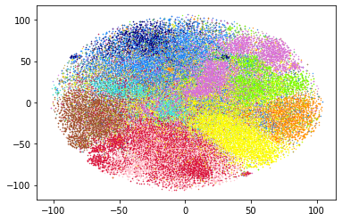
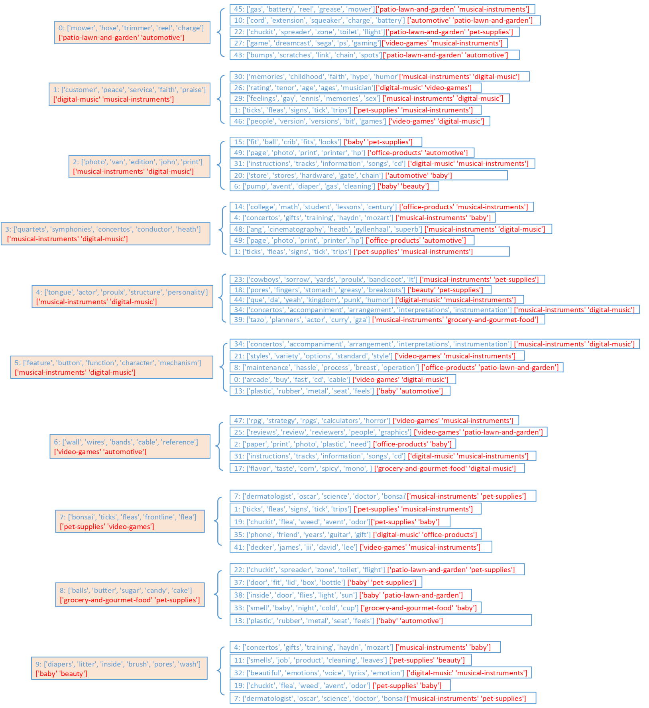

# Extracting Hierarchical Relationships of Aspects from Reviews Using Self-supervised Learning
This website provides source code and datasets for a paper presented at ECML-PKDD 2023. To train the model, please follow these steps:

(1) unzip the file amazon-review-100k.rar

(2) run the file hrea_amazon_datapreprocess.py to process dataset.

(3) run the file hrea_amazon_encoder_train.py to train a text autoencoder.

(4) run the file hrea_amazon_encoder_visual.ipynb to see the visulized reviews 

(5) run the file hrea_amazon_level1_train.py to train the first student model

(6) run the file hrea_amazon_level1_explore.py to explore the aspect-groups in first level

(7) run the file hrea_amazon_level2_train.py to train the second student model

(8) run the file hrea_amazon_level2_explore.py to explore the aspect-groups in second level

# visulization

# Hierarchical relations of aspects in the Amazondataset

