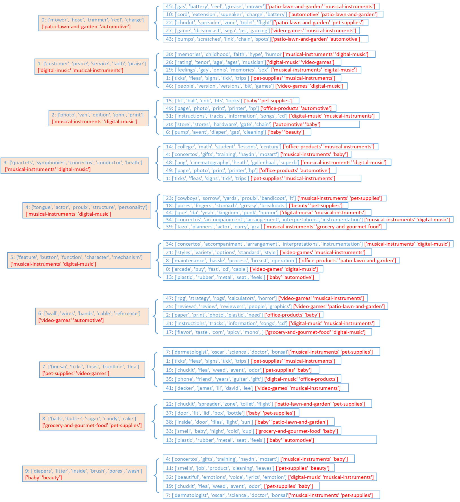
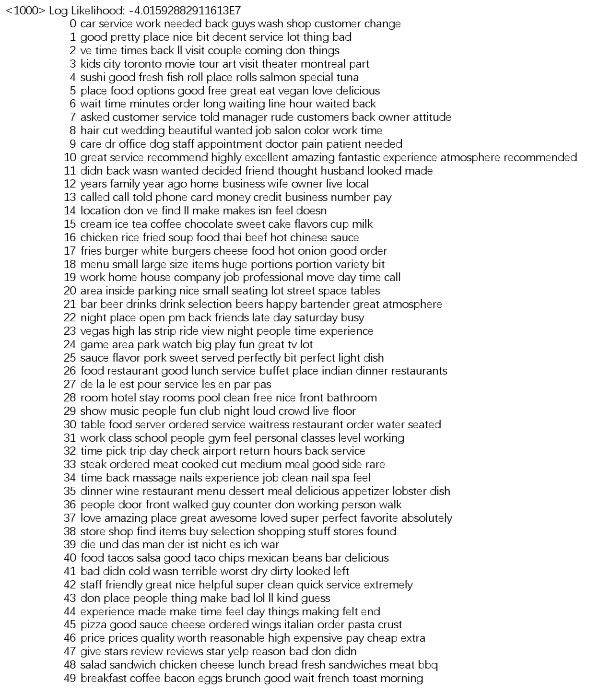

# Extracting Hierarchical Relationships of Aspects from Reviews Using Self-supervised Learning
This website provides source codes and datasets for our research paper. 

## Steps
To train the model, please follow these steps:

(1) unzip the file amazon-review-100k.rar

(2) run the file hrea_amazon_datapreprocess.py to process dataset.

(3) run the file hrea_amazon_encoder_train.py to train a text autoencoder.

(4) run the file hrea_amazon_encoder_visual.ipynb to see the visulized reviews 

(5) run the file hrea_amazon_level1_train.py to train the first student model

(6) run the file hrea_amazon_level1_explore.py to explore the aspect-groups in first level

(7) run the file hrea_amazon_level2_train.py to train the second student model

(8) run the file hrea_amazon_level2_explore.py to explore the aspect-groups in second level

## Datasets

(1) amazon-aspects-category-distribution.txt includes the category-distribution of aspect terms

(2) amazon-embeds.txt includes the words embeddings

(3) amazon-aspects.txt includes the aspect groups

(4) amazon-aspect-group-category-level1.txt includes aspect groups in the first level with categories

(4) amazon-aspect-group-category-level2.txt includes aspect groups in the second level with categories

## Visualization

This picture presents the encoded reviews in the Amazon dataset with each color representing a category.

## Hierarchical relations of aspects in the Amazon dataset

This is the hierarchical relationships of aspects extracted from the Amazon dataset with 50 banks in the first level and 10 banks in the second level. The categories of aspect groups are highlight in red. They are inferred by selecting the top two highestscoring categories from their category distributions. For each aspect group, the first five aspect terms are selected for presentation.

## Aspects clusters detected by K-means

## Aspects clusters detected by GMM

## Aspects clusters detected by LDA

## Aspects clusters detected by ABAE

